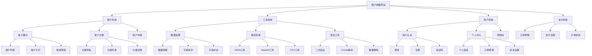

# 账户销售网站功能结构图

## 功能模块说明

### 1. 账户系统
- **账户展示**
  - 账户列表：展示所有可购买的账户
  - 账户卡片：单个账户的简要信息
  - 搜索筛选：按条件筛选账户
- **账户分类**
  - 分类导航：不同类型账户的导航
  - 分类列表：同类型账户的展示
  - 分类详情：分类的详细说明
- **账户详情**
  - 账户信息：账户的详细信息
  - 购买说明：购买流程和注意事项
  - 售后服务：服务保障说明

### 2. 工具系统
- **数据处理**
  - 数据清理：清理无效数据
  - 字段排序：调整字段顺序
  - 字段补全：补充缺失字段
- **格式转换**
  - JSON工具：JSON格式化和验证
  - Base64工具：Base64编解码
  - CSV工具：CSV数据处理
- **安全工具**
  - 二次验证：Google验证器
  - Cookie解析：Cookie数据解析
  - 数据移除：敏感数据清除

### 3. 用户系统
- **用户认证**
  - 登录：用户登录功能
  - 注册：新用户注册
  - 验证码：图形验证码
- **个人中心**
  - 个人信息：基本资料管理
  - 订单管理：订单记录查看
  - 安全设置：账户安全配置
- **购物车**
  - 商品管理：添加/删除商品
  - 结算功能：商品结算
  - 价格计算：总价计算

### 4. 支付系统
- **订单管理**
  - 订单创建：生成订单
  - 订单确认：确认订单信息
  - 订单记录：历史订单查询
- **支付流程**
  - 支付方式：选择支付方式
  - 支付处理：处理支付请求
  - 支付验证：验证支付结果
- **订单状态**
  - 状态跟踪：订单状态更新
  - 状态通知：状态变更通知
  - 状态查询：订单状态查询 